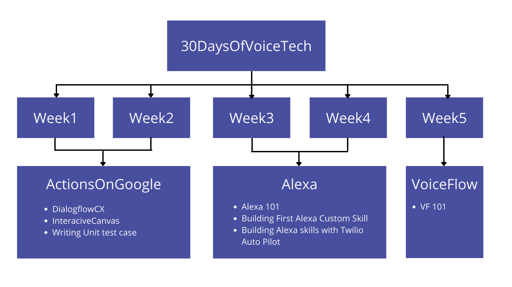

  

  <h1>30DaysofVoiceTech</h1>
  
Journal of what i have learned, played, created in AoG,Alexa and VoiceFlow

  
From: 01-02-2021 &nbsp;  To: 02-03-2021

   

  <h1>Plan for 30 Days</h1> 
  

| Day  | Task | Status |
| :-------------: | :------------- | :----------: |
| Day 1  | Dialogflow CX - 101 | Done |
| Day 2  | Dialogflow CX Basics - Part 1 | Done |
| Day 3  | Dialogflow CX Basics - Part 2 | Done |
| Day 4  | Dialogflow CX Pages and Transistions | Done |
| Day 5  |  |  |
