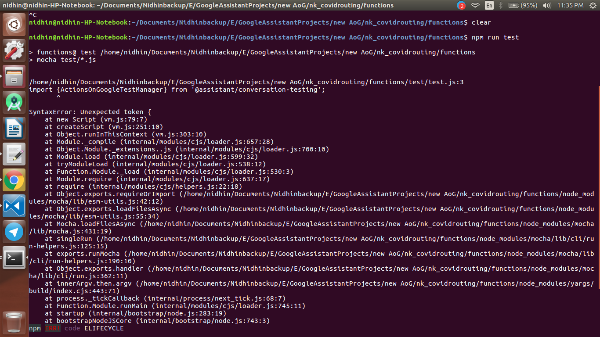

<div align="center">
  <h1>VoiceTech - Day 13</h1>
  <p>Unit testing</p>
</div>

<h2 align="center">GoogleAssistant - Unit testing test suite</h2>

Open the existing Google Assistant project and install the conversation-testing library like below

```
npm install @assistant/conversation-testing --save
```

Install `mocha` and `chai` using the below command

```
npm install --save-dev mocha 
npm install --save-dev chai
```

Once installed download the `service-account.json` file for the project from GCP.Create a `.env` file and add the below line along with the path of `service-account.json` file

```
export GOOGLE_APPLICATION_CREDENTIALS = /path/of/service-account.json
```

Once done open the package.json file and add the test script

```
"test": "mocha --recursive --require ts-node/register src/test/*.ts"
```

Now create a foled named `test` inside `src` directory and add the basic skeleton of the test configuration like below

```
import 'mocha';

import {ActionsOnGoogleTestManager} from '@assistant/conversation-testing';

const PROJECT_ID = '<ACTION_PROJECT_ID>';
const TRIGGER_PHRASE = 'Talk to <ACTION_DISPLAY_NAME>';

describe('Test Suite', function() {
  // Set the timeout for each test run to 60s.
  this.timeout(60000);
  let testManager;

  before('Before all setup', async function() {
    testManager = new ActionsOnGoogleTestManager({ projectId: PROJECT_ID });
    await testManager.writePreviewFromDraft();
    testManager.setSuiteLocale(DEFAULT_LOCALE);
    testManager.setSuiteSurface(DEFAULT_SURFACE);
  });

  afterEach(function() {
    testManager.cleanUpAfterTest();
  });
});
```

Now change the PROJECT_ID with your project id and then run your spec file using the command `npm run test`

Since my projec is created using javascript while running the spec i am getting the following error

<div align="center">
  
</div>