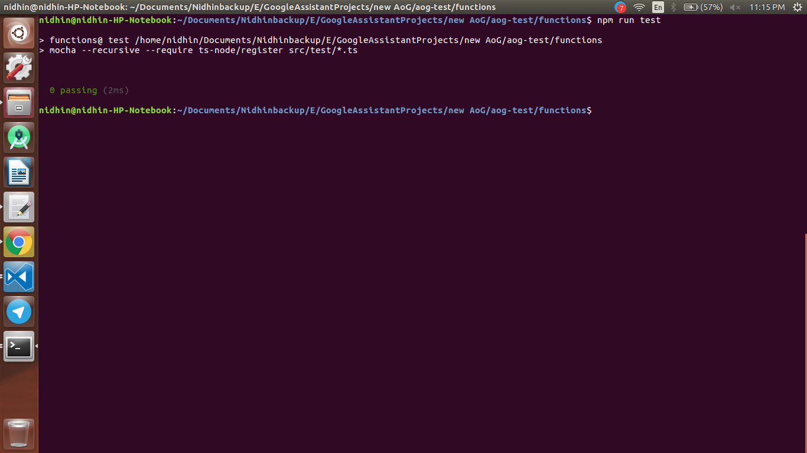

<div align="center">
  <h1>VoiceTech - Day 14</h1>
  <p>Unit testing</p>
</div>

<h2 align="center">GoogleAssistant - Unit testing - PoC - Part1</h2>

Created a new cloud function with Typescript to check whether the testing part works fine or not.

Once the project is created Installed the `mocha`, `chai`, `ts-node` and `conversation-testing` libraries along with it's types

After that updated the `tsconfig.json` file like below

```
{
  "compilerOptions": {
    "module": "commonjs",
    "moduleResolution": "node",
    "rootDir": "src/",
    "outDir": "dist",
    "allowSyntheticDefaultImports": false,
    "noImplicitAny": true,
    "strictNullChecks": true,
    "alwaysStrict": true,
    "noUnusedLocals": true,
    "resolveJsonModule": true,
    "esModuleInterop": true,
    "target": "es2017"
  },
  "compileOnSave": true,
  "include": [
    "src/**/*.ts",
    "test/**/*.ts"
  ]
}
```

Once done create a new folder named `test` and then add a file named index.ts in which write the basic skeleton for test like below

```
import 'mocha';

import {ActionsOnGoogleTestManager} from '@assistant/conversation-testing';

const PROJECT_ID = 'covid-routing';
const TRIGGER_PHRASE = 'Talk to covid routing';
const DEFAULT_LOCALE = 'en';
const DEFAULT_SURFACE = 'phone';

describe('Test Suite', function() {
  // Set the timeout for each test run to 60s.
  // tslint:disable-next-line:no-invalid-this
  this.timeout(60000);
  let testManager: ActionsOnGoogleTestManager;

  before('Before all setup', async function() {
    testManager = new ActionsOnGoogleTestManager({ projectId: PROJECT_ID });
    await testManager.writePreviewFromDraft();
    testManager.setSuiteLocale(DEFAULT_LOCALE);
    testManager.setSuiteSurface(DEFAULT_SURFACE);
  });

  afterEach(function() {
    testManager.cleanUpAfterTest();
  });
});
```

Update the `package.json` file to run the test like below

```
"test": "mocha --recursive --require ts-node/register src/test/*.ts",
```

Once done run the test using the command `npm run test` which will pass since there is no specs

<div align="center">
  
</div>