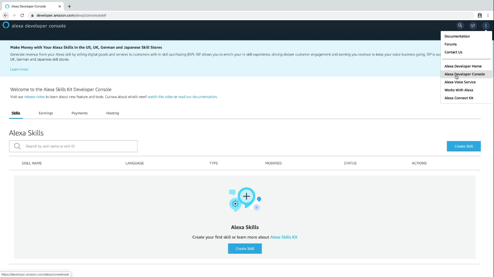
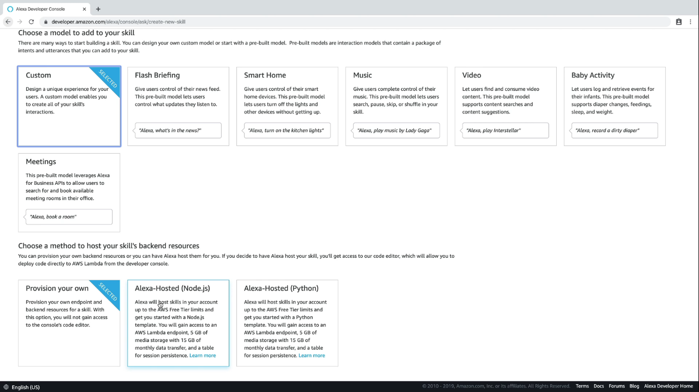
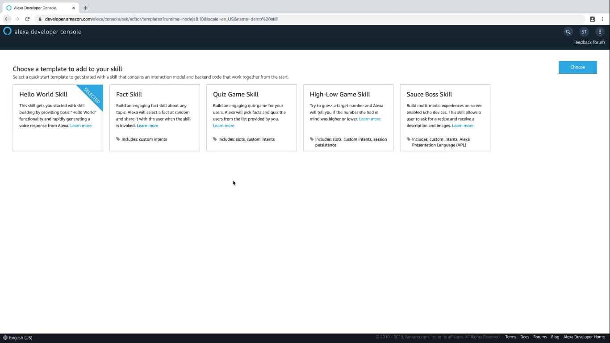
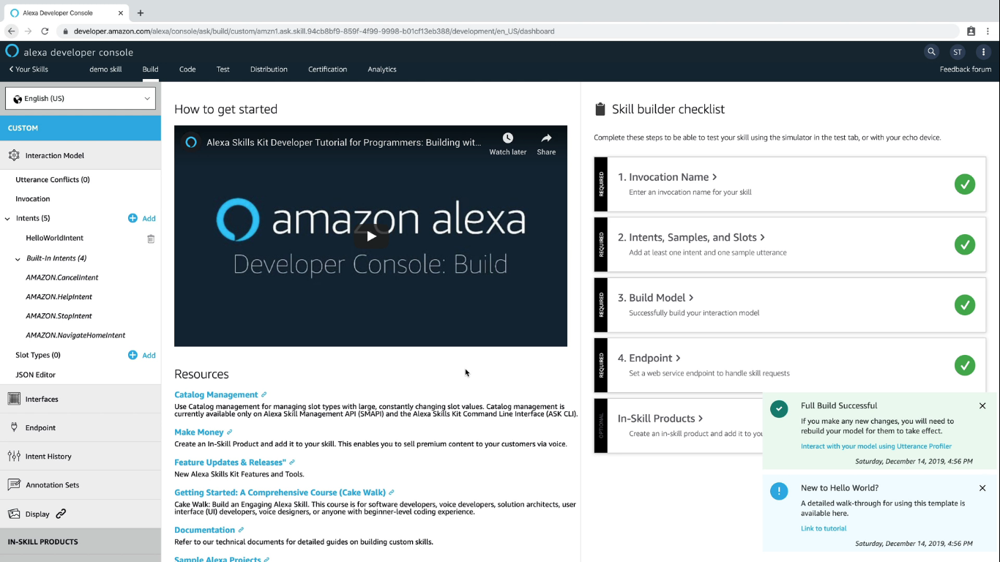
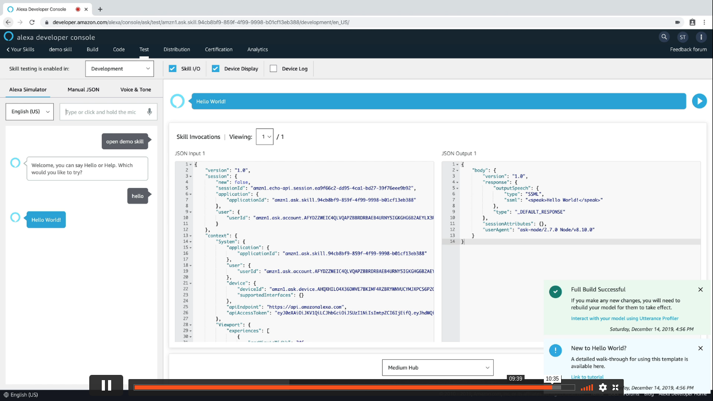

  <h1>VoiceTech - Day 15</h1>
  
Alexa Skill

<h2 align="center">Alexa Skill - 101</h2>

Create a new skill in Alexa go to `alexa.developer.com` and once gone to the page login with the credentials or else signup once signed up you could see a screen like below

  

Click `Create Skill` which is available on the top right once clicked you could see the modal selection page like below

  

Once the modal is selected it will be asked for selecting a template choose the `Helloworld skill` or the skill which you like

Once selected you could see a screen like below

  

Once a skill is selected you could see a build page like below where we will write the conversation with Intents, Types 

  

To test a skill click on the test tab where we can test our skill

  

Now the basic setup of creating a skill is done next we will see how to customize the skill a.k.a building the skill