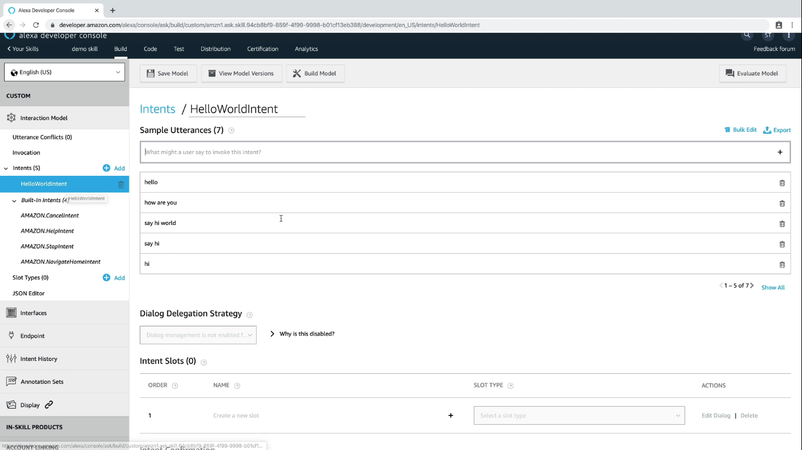
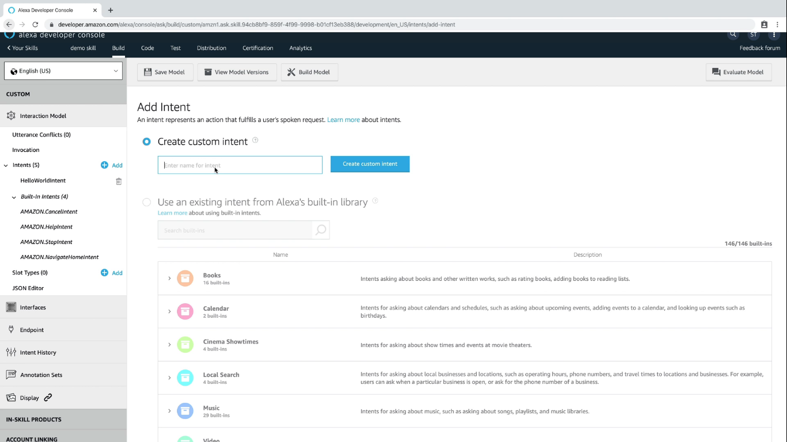
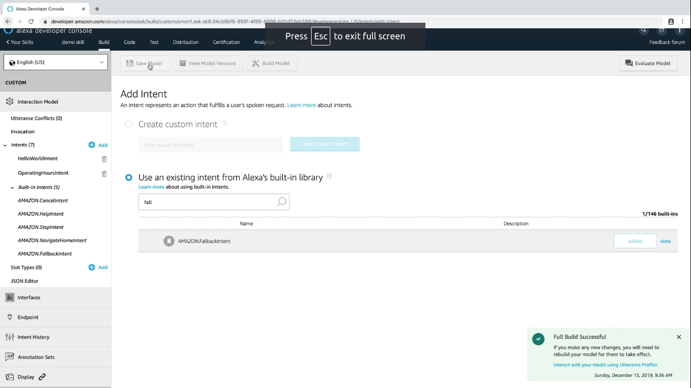
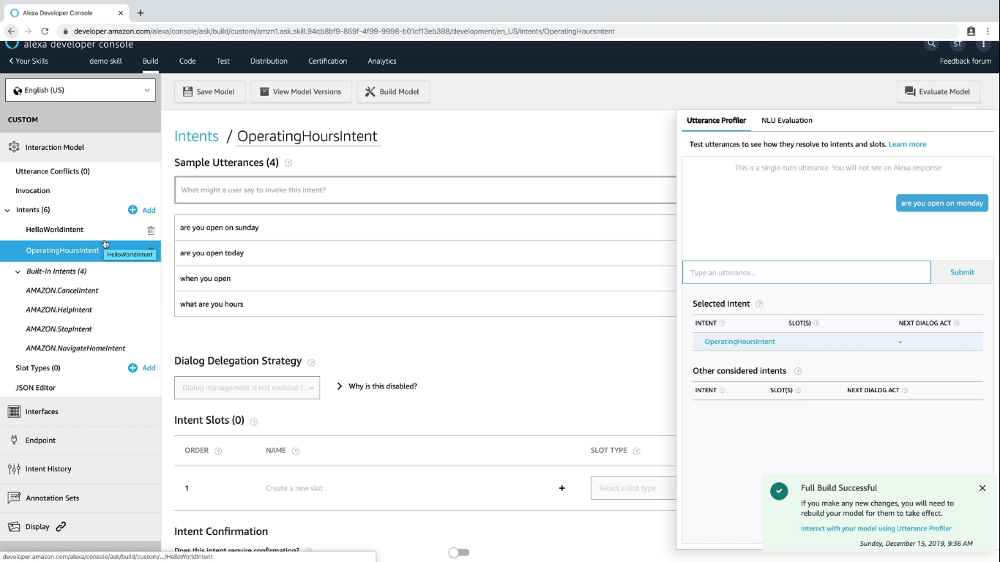

  <h1>VoiceTech - Day 16</h1>
  
Alexa Skill

<h2 align="center">Alexa Skill - 101</h2>

### Intents

It is similar like the Google Assistant where we will invoke a particular action when it is matched

  

Intents are classified into 2 types

1. Custom Intents
2. Build-in Intents

### Custom Intents

Intents which are built by us

  

### Build-in Intents

Intents which are built by the system a.k.a System Intents

  

Testing the intents

  

