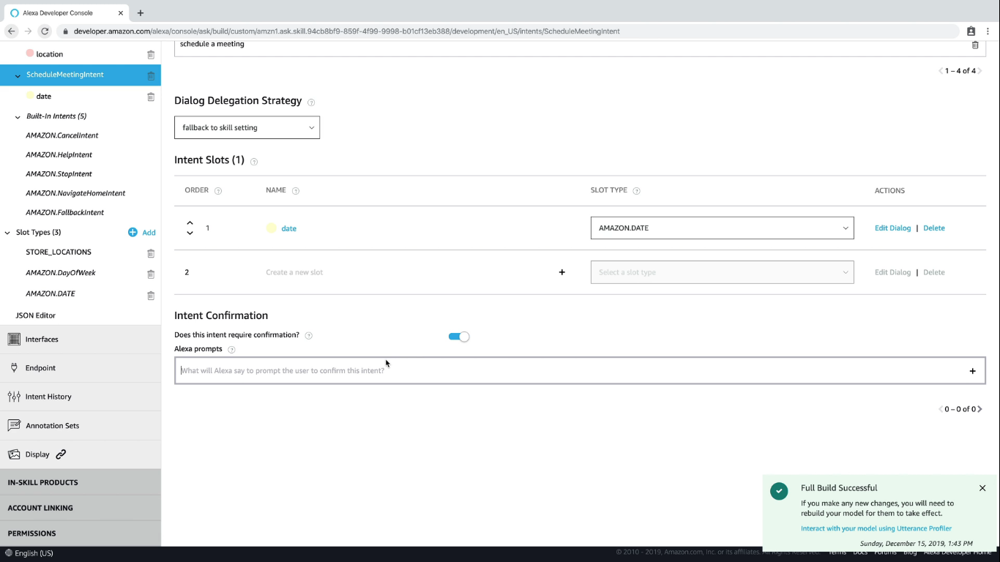

  <h1>VoiceTech - Day 18</h1>
  
Alexa Skill

<h2 align="center">Alexa Skill - 101</h2>

### Slot Confirmation

Slot confirmation is like getting a confirmation from the user while filling a form based on the confirmation we can move to next intent or we can stop the conversation

To enable slot confirmation select the slot which you need confirmation from the user that is for a intent we will have the slots and once we select the slot we can see the Enable slot confirmation.

`Intent -> Slots -> Slot Confirmation`

Based on the confirmation it will become a required field

  

