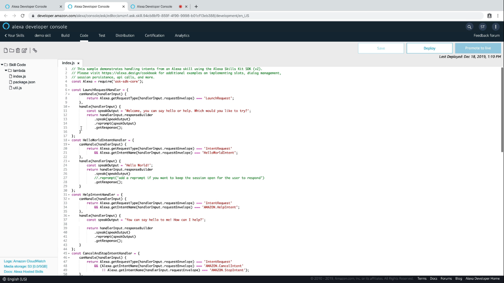

  <h1>VoiceTech - Day 19</h1>
  
Alexa Skill

<h2 align="center">Alexa Skill - 101</h2>

AWS Lambda is similar like the Cloud Function where both are done using Node.js

For every intent handler there is a function defined which invoked when an intent performs an action similar like connecting to webhook in Google Assistant

  

