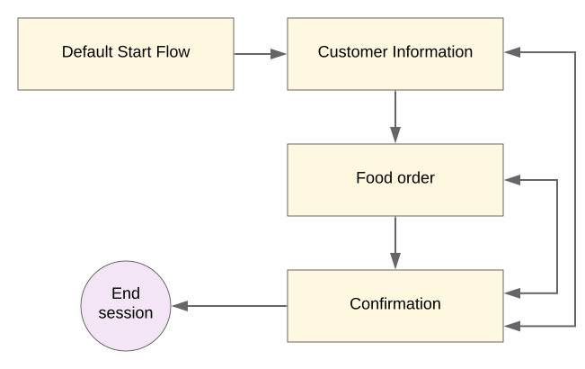
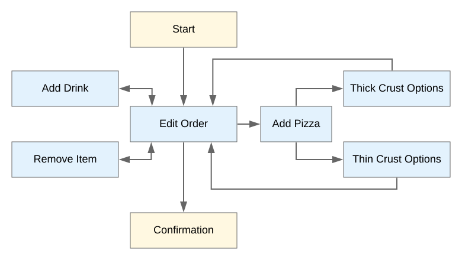

  <h1>VoiceTech - Day 2</h1>
  
Dialogflow CX - Basics

<h2>Dialogflow CX - Basics - Part 1</h2>

### 1.Agents

Dialogflow CX Agent is a virtual agent that handles conversations with end-users. It translates end user audio/text to structured data that the app/service can understand. It is similar like human call-center

### 2.Flows

Flows are used to design topics and the associated conversational paths.Every flow has a defaut start flow(It is enough for a simple agent) but for complicated agents we are in need of flows E.G: Pizza delivery agent might require UserInformation Flow, Payment Flow and Confirmation Flow
It is similar like sub-agents in Dialogflow ES

  

### 3.Pages

For each Flow we can "n" number of pages by default each flow will have one page.And exactly one page is the current page.The current page would be the active page

  

### 4.Entity Types

Entity-types are used to control how data from end-user is extracted.It is similar like Dialogflow ES
It supports 
   * System-entities
   * Custom-entities

For Example an Vegetable entity can have th list of vegetables

### 5.Parameters

Parameters are used to capture and reference values that have been supplied by the end-user during a session.

CX Parameters are similar like ES Parameters but the utility and scope has been expanded

### 6.Forms

It is similar like slot-filling which collects the list of parameters from end-user from a page.

Example: Customer Info Page which collects username, age,address from a page and this process is called form filling

### 7.Intents

Intent contains Training Phrase and Parameters 

* Training Phrases - Example phrase what end-user might type or say known as end-user input,When end-user phrases matches with any of the training phrases then the intent is invoked.
* Parameters - To extract values from specific parts of the end-user inputs