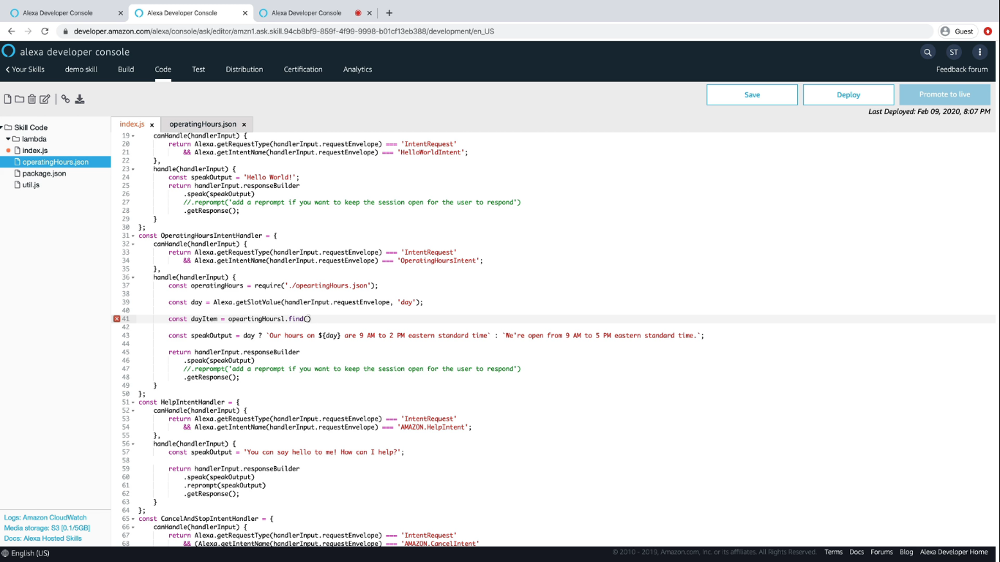

  <h1>VoiceTech - Day 20</h1>
  
Alexa Skill

<h2 align="center">Alexa Skill - 101</h2>

Using Slot values in the backend code (AWS Lambda)

  

Adding a json object from which when the user selects a day we will check the hours for the user selected day and show the message accordingly

  

  

