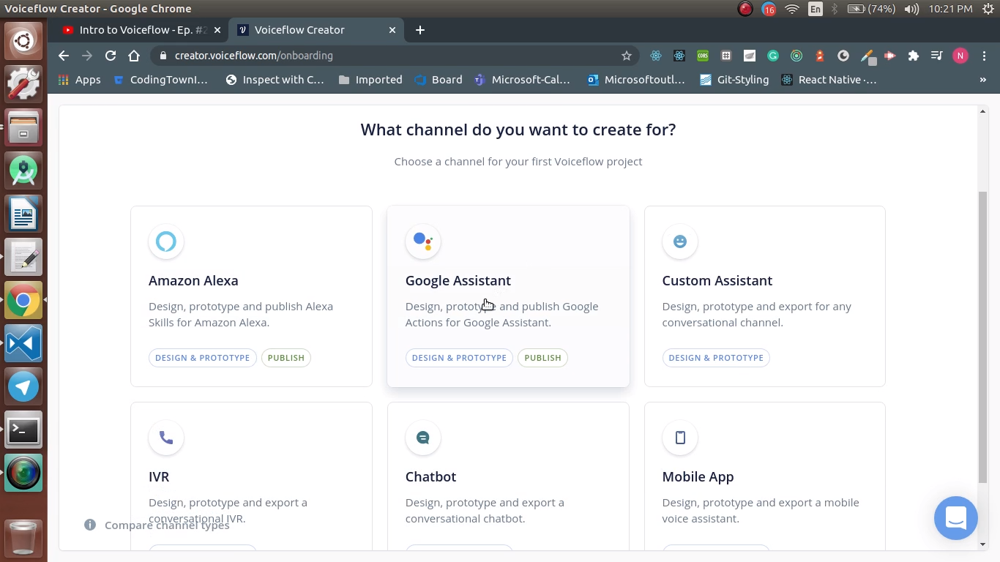

  <h1>VoiceTech - Day 25</h1>
  
Voiceflow

<h2 align="center">Voiceflow - Intro</h2>

Voiceflow is used to design, prototype and launch conversational apps

Creating profile in voiceflow

  

Voiceflow channels - List of channels where we can use voiceflow

  

Voice canvas - Place where we drag n drop the intents, speeches

  

Editing a block - We can edit the block by click it which will show the text with effects as well as audio which can be used before the text or if it is not needed we can delete it by dropping it

  

Logics - The different set of logics which can be incorporated with our action

  

Channels - List of channels which can be incorporated with our action like API, Google Sheet, Airtable, Custom code, etc

  

## Pricing

Free - 2 projects