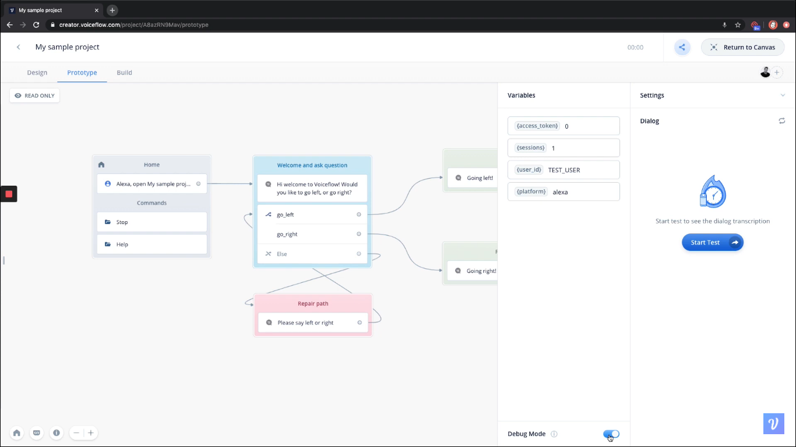
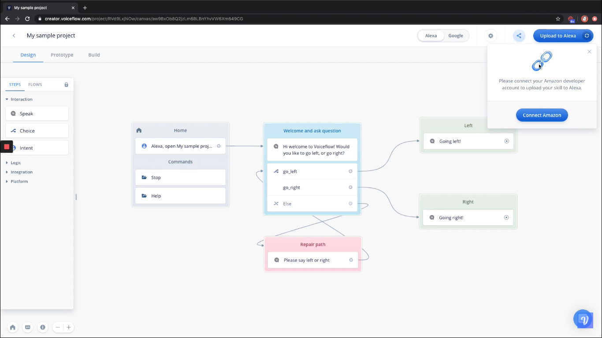
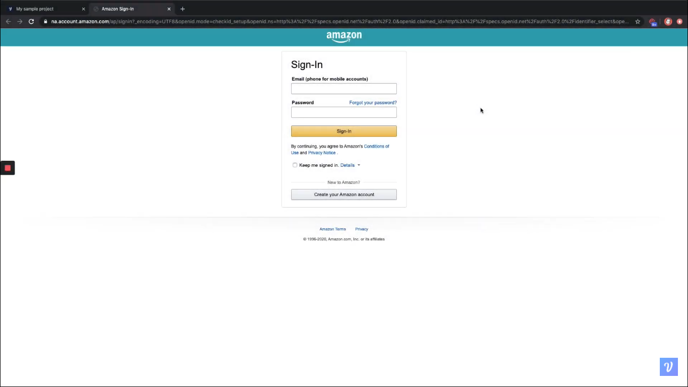
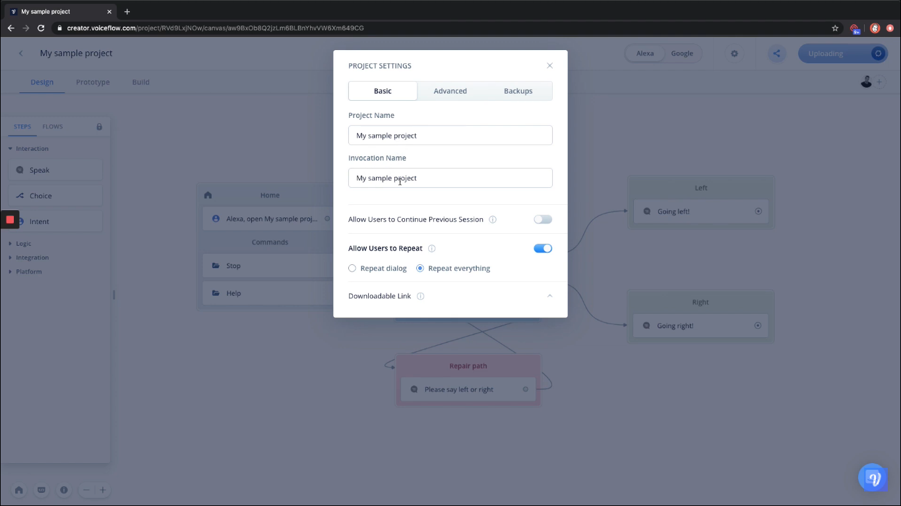

  <h1>VoiceTech - Day 26</h1>
  
Voiceflow

<h2 align="center">Voiceflow Debugging and uploading the skill to Alexa</h2>

Debugging the voiceflow interaction

  

Uploading the skill to Alexa

Click the upload option and then add the Alexa credentials like below

  

  

What ever the name we set in Voiceflow will be used as the invocation name and if need to change the invocation name then it can be done like below

  

