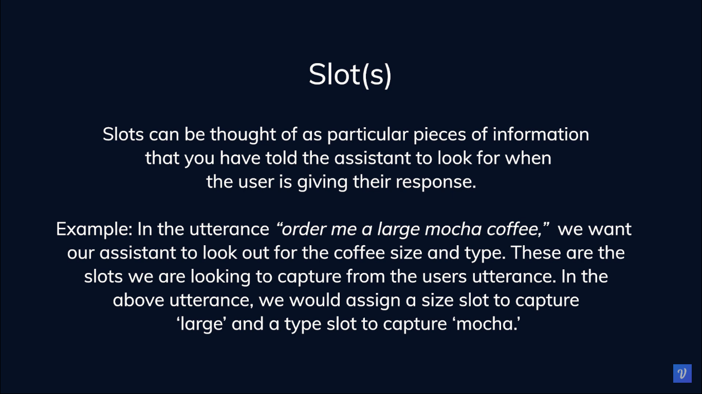
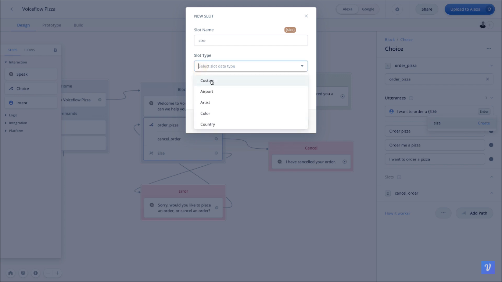
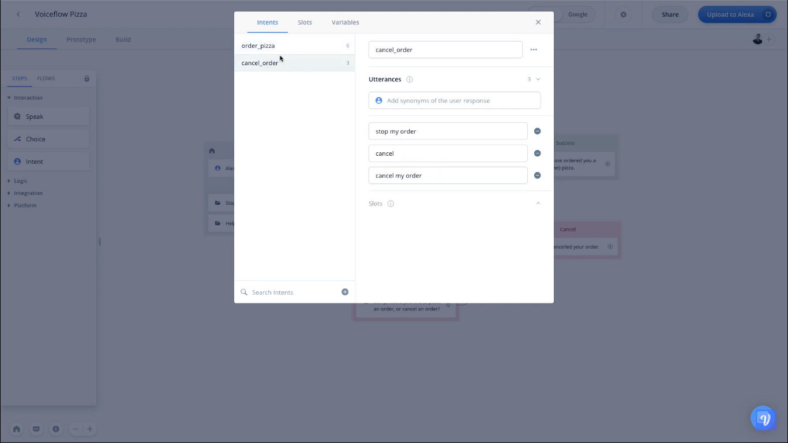
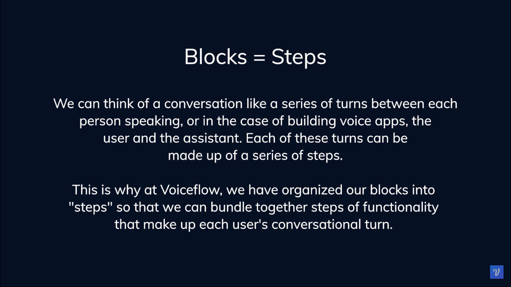
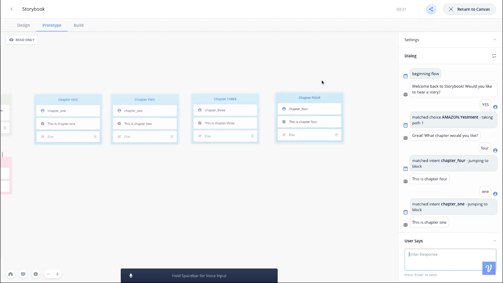

  <h1>VoiceTech - Day 28</h1>
  
Voiceflow

<h2 align="center">Slots and Interaction Modal Manager</h2>

## Slots

Slots are similar like a form filling where we will capture the user inputs to the process it for further use

  

Adding a custom value for the slot

  

## Interaction Modal Manager

To view the history of the created slots and intents we will use the Interaction Modal Manager like below

  

## Block Steps

  

## Global Intent Blocks

  

