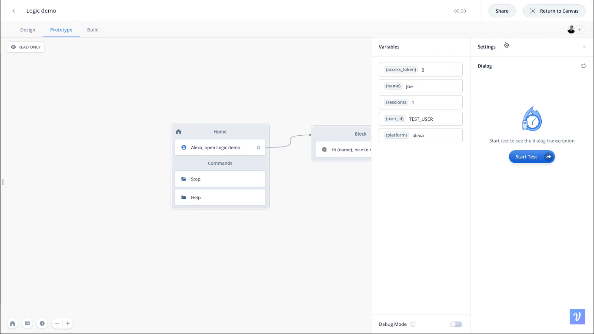
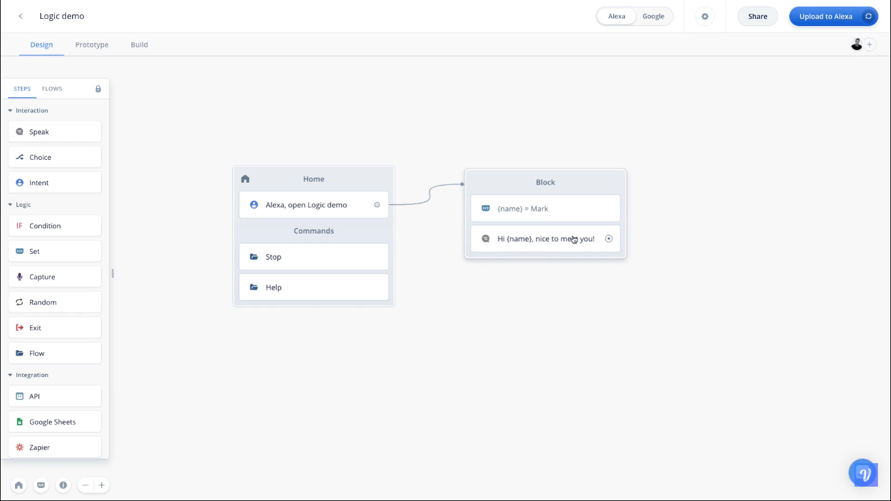
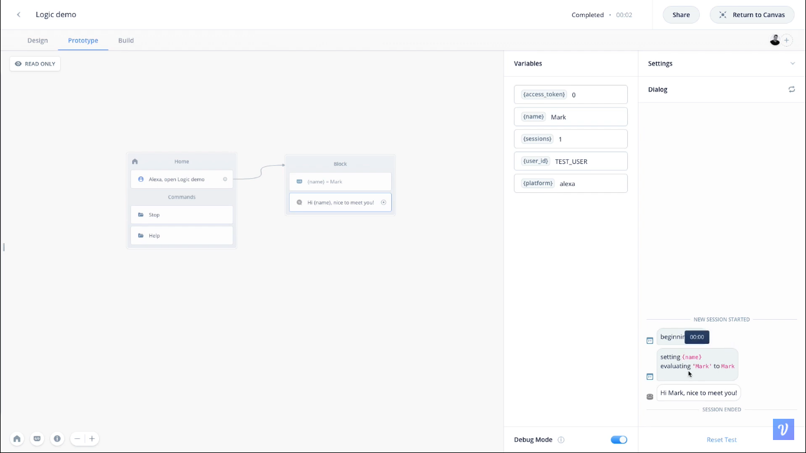
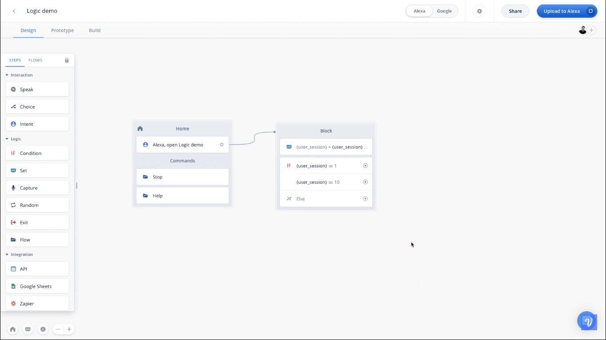

  <h1>VoiceTech - Day 29</h1>
  
Voiceflow

<h2 align="center">Voiceflow Intro to Logic</h2>

## Variable

Variable is a temporary storage where we will keep the information.For example if we need to remember the name of the user during the entire flow we can store it in the variable

  

## Setting Variable

To set a value to the varible we can use the set variable option like below

  

  

## Conditional Step

Conditional step is like setting a condition to to execute an action/flow

  

