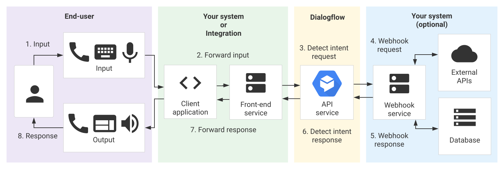

  <h1>VoiceTech - Day 3</h1>
  
Dialogflow CX - Basics

<h2>Dialogflow CX - Basics - Part 2</h2>

### 8. Fulfillments

Fulfillment is used to send a static response message, webhook calls for dynamic responses, Parameter presets to set/override parameter values.

ES Fulfillment is limited to connecting a service but whereas CX covers all types of prompts and responses

### 9. State handlers

It is used to control conversation by creating response for end-users or by transisting the current page 

Handlers have 3 general type of datas

* **Handler requirements** - A handler is said to be called when it satisfies its requirements and affects the session in some way.
* **Handler fulfillment** - If a handler is called, an optional fulfillment is used to create responses for end-users.These responses are either defined in static agent data or retrieved dynamically from your webhook service.
* **Handler transistion target** - If a handler is called, an optional transition target is used to change the current page. The next page can only be a flow start page or a page within the currently active flow.

There are 2 types of state handlers with differing handler requirements

* **Routes** - Routes are called when an end-user input matches an intent and/or some condition on the session status is met. A route with an intent requirement is also called an intent route. A route with only a condition requirement is also called a condition route.
* **Event Handlers** - Event handlers are called when an event is invoked. Some built-in events are triggered when unexpected end-user input is received, or when a webhook error occurs.

There are 3 steps to process a state handler

* **Scope** - A handler must be in scope to have any effect on the session. The scope is determined by whether a handler is applied to a flow, a page, or a form parameter; 
* **Evaluation** - Each handler in scope is evaluated in order. If a handler's requirements are met, it passes evaluation.
* **Call** - If a handler is in scope and passes evaluation, it is called. Any associated fulfillment is called, and any associated transition target is applied to the session.

### 10.Regionalization and location settings

When you create an agent, you must specify a region as the agent's location. Requests sent to your agent are handled by Google services in this region. For the best performance, you should choose a region that is near your services and end-users.Once an agent is created, its location cannot change. In order to change an agent's location, you must export and restore to a new agent with a different location.

### 11.Console

The CX Console has a similar purpose as the ES Console, but the CX Console user interface is much more visual. It graphs each flow as a conversational state machine diagram, which makes complex agents easier to design and understand.

### 12.Integrations

Dialogflow CX currently provides several built-in integrations with other conversation platforms. These integrations provide a user interface to the end-user, and they call the Dialogflow API for you. All you need to do is build your agent and optionally implement a webhook service. 

### 13. Interactions

For each conversational turn, an interaction takes place. During an interaction, an end-user sends input to Dialogflow, and Dialogflow sends a response. You have two options when implementing your system to handle interactions: using the API or using an integration.

When using an integration, your system only needs to handle the following:

* Build an agent.
* Optionally implement a webhook service.

  

