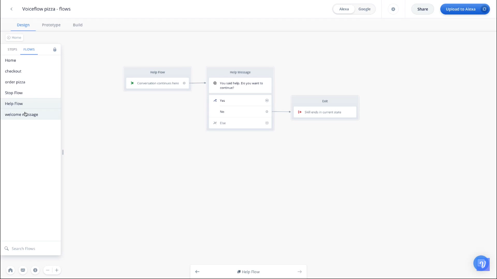
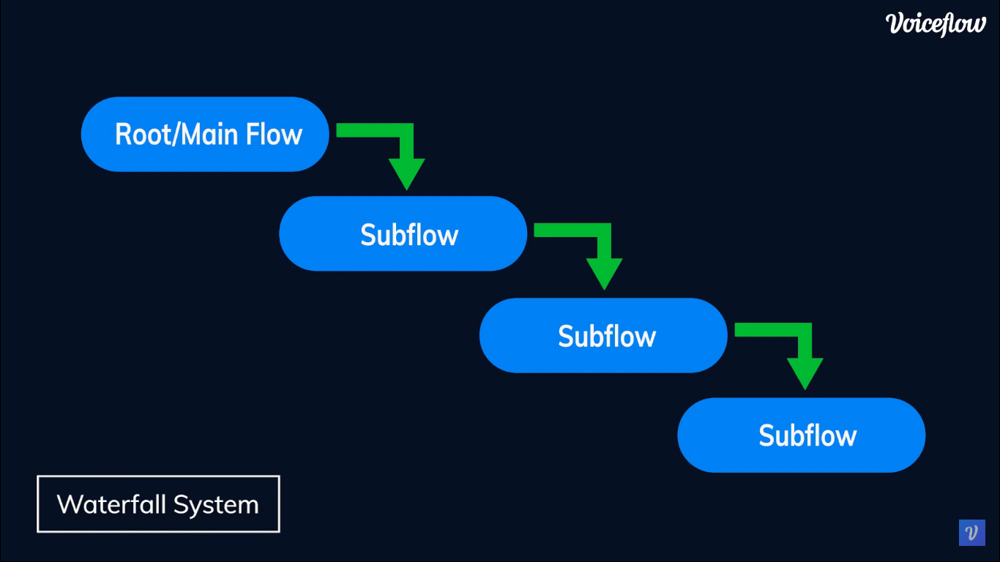
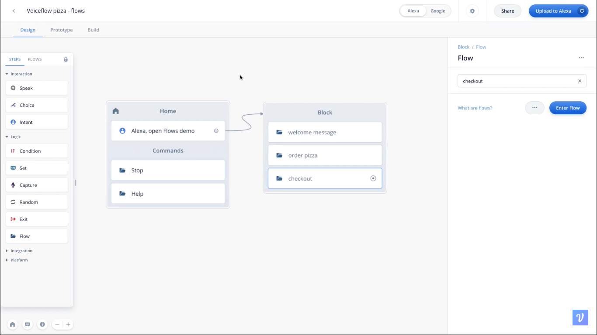

  <h1>VoiceTech - Day 30</h1>
  
Voiceflow

<h2 align="center">Voiceflow Flows and Commands</h2>

Flows - Reusable components which can be reused and modularize the components

1. Understanding Flows
2. Creating a Flow
3. Subflows
4. Reusing Flows in Project
5. Command Flows

### Understanding Flows

  

### Subflows

  

### Reusing a flow

Flows which can be reused within a block

  

### Command Flows

It allows the user to do a task and bring them back to the place where they are in the conversation
