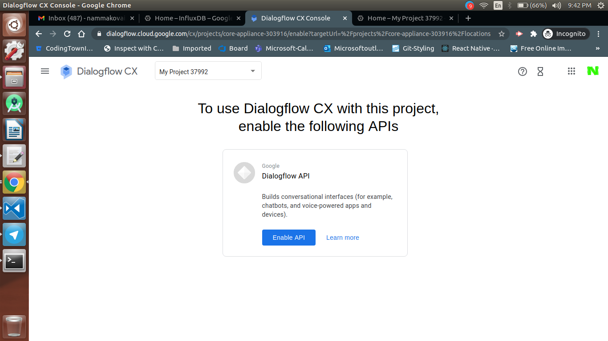
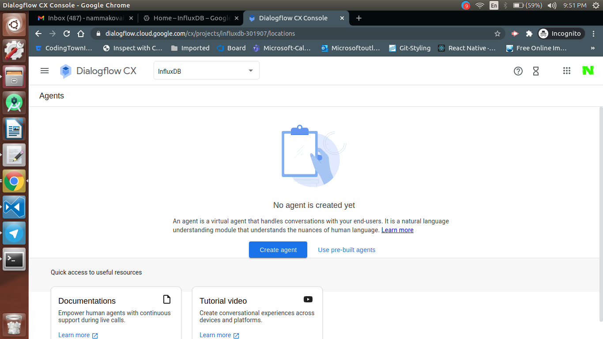
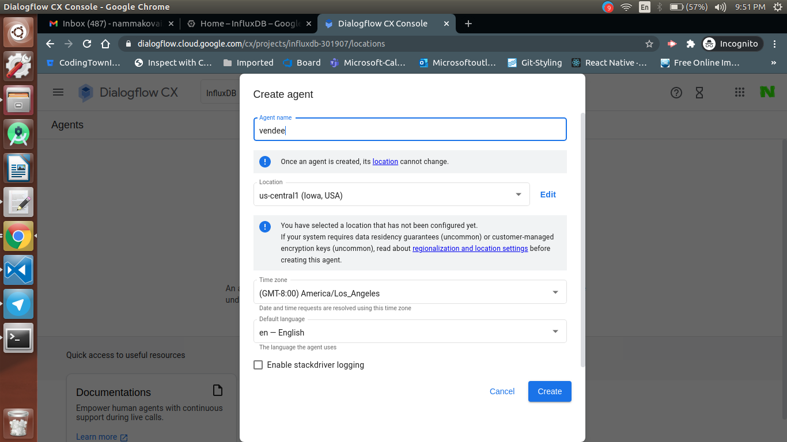
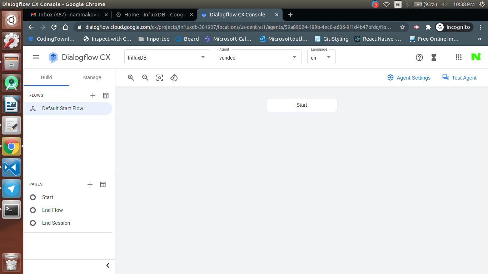
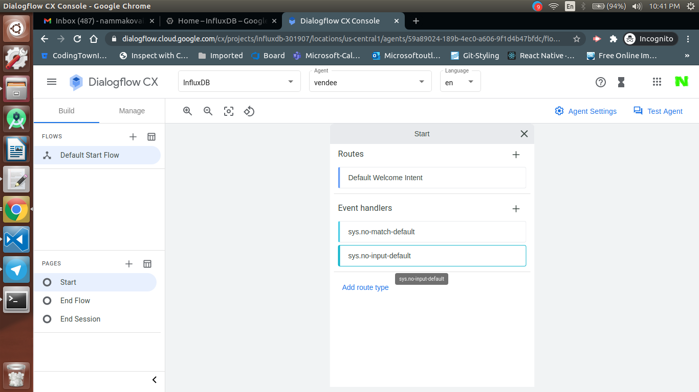
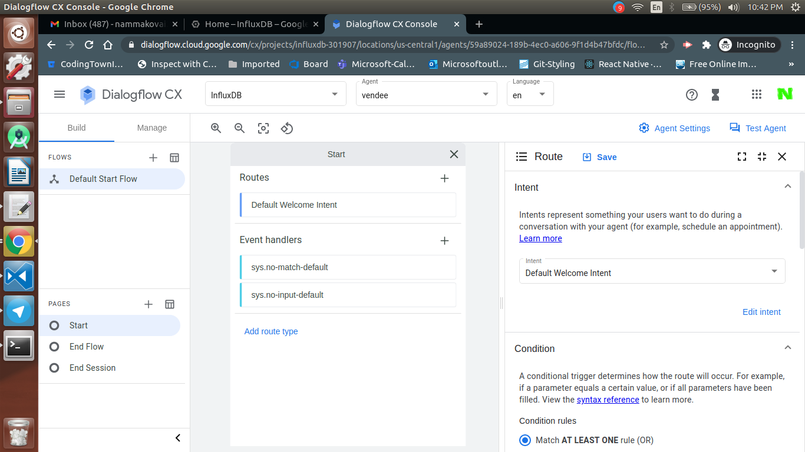

  <h1>VoiceTech - Day 5</h1>
  
Dialogflow CX - Basics

<h2 align="center">Vending Machine - PoC</h2>

This PoC's is used to experiment the Dialogflow CX and how to create an Agent in Dialogflow CX

Enabling the Dialogflow API

  

Creating a new agent in Dialogflow CX

  

Filling the agent details, location and language

  

Dialogflow CX console

  

Opening a flow, by clicking the flow that is the start flow which will open the flow and once selected it will open the routes etc

  

Opening routes: When a route is clicked it will show the intent, condition, fulfillment, transistion page 

  

