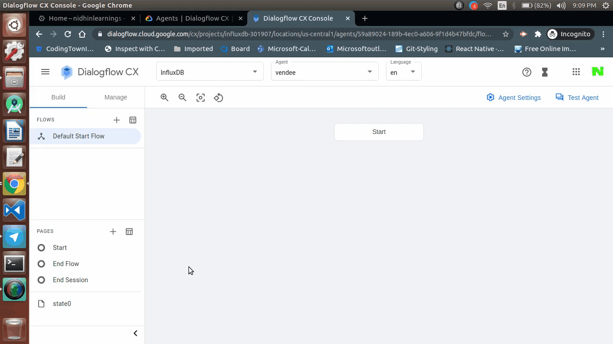

  <h1>VoiceTech - Day 6</h1>
  
Dialogflow CX - Basics

<h2 align="center">Vending Machine - PoC</h2>

#### Creating Pages in Dialogflow CX

  

#### Creating Intents in Default Start

  

#### Page Transistion from one page to another

  

Check the assets directory for the video